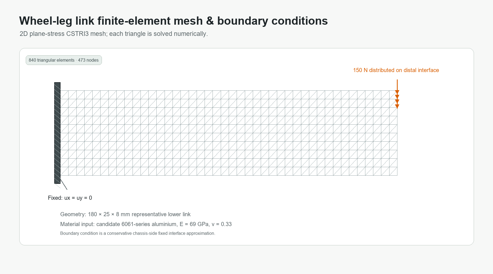
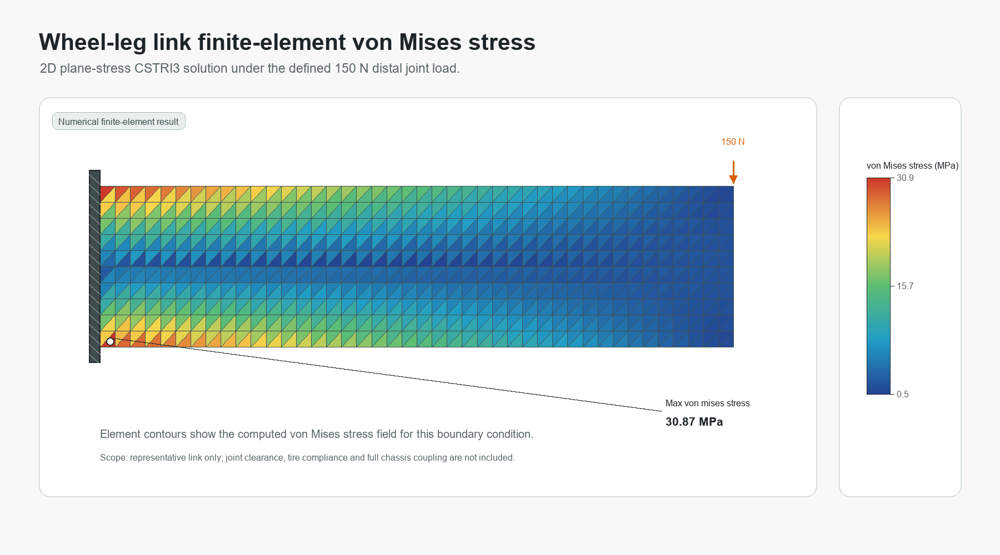
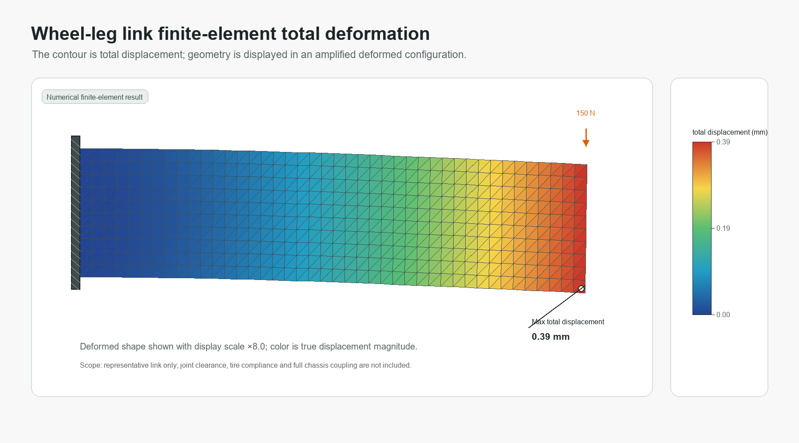

# 森林野外数据采集小车

**Forest Field Data Rover**

面向森林样地环境数据采集与火险监测场景的轮腿式移动平台概念设计。项目由 SolidWorks 多实体结构建模、结构展示图与代表性轮腿下连杆的局部有限元静力分析组成。

## 1. 结构设计

### 设计目标

小车面向非铺装林区样地巡测，采用四轮轮腿式越障机构：车体为传感器、定位和供电模块提供安装空间；轮腿机构通过关节和两段连杆调节轮端位置；底部预留近地面探针安装位，用于概念性承载环境采样设备。

### 整体结构

主要结构模块：

| 模块 | 结构作用 |
| --- | --- |
| 主车体与前端传感器壳体 | 提供电子设备、相机与顶部模块的安装基体，并形成主体刚度来源。 |
| 四组轮腿机构 | 由车体侧连接座、关节件、上/下连杆与轮端连接组成，服务于越障和离地间隙调节。 |
| 轮胎与轮毂 | 采用较宽轮胎比例，增强非铺装地面通过性与接地稳定性。 |
| 顶部传感模块 | 包括圆柱式环境传感器、风速仪桅杆、通信天线和服务把手的概念安装位置。 |
| 底部探针模块 | 在车体下方布置近地面探针及其防护连接结构。 |

### 正视与顶视

| 正视图 | 顶视图 |
| --- | --- |
|  |  |

正视图用于检查四轮轮距、轮端高度与车体侧连接关系；顶视图用于检查车体壳体轮廓、顶部传感器安装区与左右轮腿的空间布置。

### 概念爆炸结构示意

爆炸示意基于本项目等轴测结构图生成，用于清晰展示车体、顶部模块、轮胎、轮毂、关节件与两段连杆的装配层级和连接方向。该图是项目展示用的**概念爆炸结构示意**，不是由 SolidWorks 爆炸配置直接导出的工程图。

## 2. 局部有限元静力分析

有限元部分为真实的数值有限元求解，不以解析公式替代。分析对象是轮腿机构中的代表性下连杆，而非包含所有关节、轮胎和车体的整车装配体。

| 项目 | 设置 |
| --- | --- |
| 分析对象 | 180 × 25 × 8 mm 代表性下连杆 |
| 单元类型 | CSTRI3 二维平面应力三角形单元 |
| 候选材料输入 | 6061 系铝合金，E = 69 GPa，ν = 0.33 |
| 边界条件 | 车体侧安装端的面内自由度固定 |
| 载荷工况 | 轮侧端面总计 150 N 向下分布力 |
| 网格规模 | 840 个单元，473 个节点，946 个自由度 |
| 最大 von Mises 应力 | 30.87 MPa |
| 最大总位移 | 0.390 mm |

### 网格与边界条件

### von Mises 应力云图

### 总位移云图

### 结果适用范围

- 6061 系铝合金是仿真候选材料输入，不代表项目已完成真实制造材料或设备品牌选型。
- 当前模型不包括销轴接触、关节间隙、螺栓预紧、轮胎柔顺性、车体柔度与真实地形时程。
- 结果用于代表性连杆在设定载荷下的结构趋势与局部校核；整车工程定型仍需要完整装配体接触、模态和疲劳验证。

## 3. 文件说明

- `index.html`、`site.css`：GitHub Pages 静态展示网页。
- `isometric.png`、`front.png`、`top.png`、`back.png`、`left.png`、`right.png`、`bottom.png`：整车结构视图。
- `rover_concept_exploded_view.png`：概念爆炸结构示意。
- `fea_mesh_boundary_conditions.png`、`fea_von_mises_stress.png`、`fea_total_deformation.png`：有限元结果图。
- `fea_results.json`、`FEA_README.md`：有限元结果数据和方法说明。
- `run_link_plane_stress_fea.py`：本地有限元求解与云图生成脚本。
- `forest_lfmc_fire_rover_final.SLDPRT`：最终展示模型。
