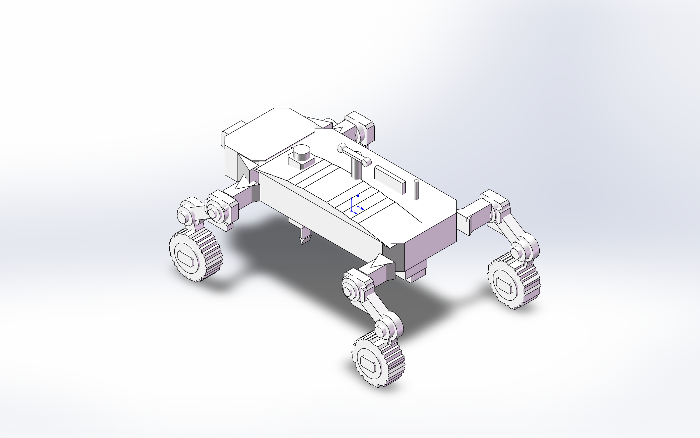
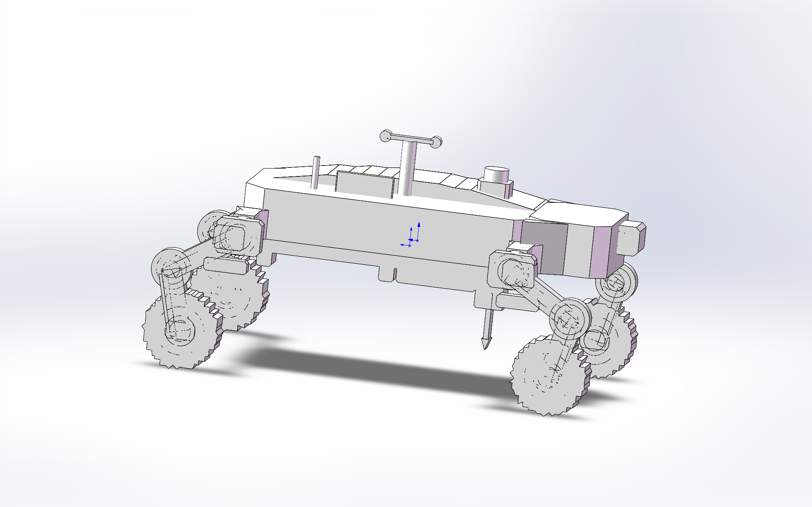
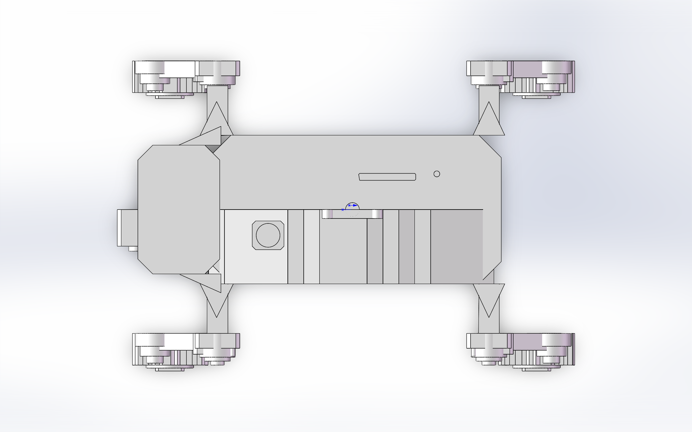

# 森林野外数据采集小车

Forest Field Data Collection Rover

面向森林样地数据采集与火险监测场景的轮腿式野外数据采集小车概念设计。

本项目基于 SolidWorks 完成单零件多实体结构建模，重点展示车体结构、四轮轮腿机构、连接件、传感器安装区域和野外数据采集平台的整体设计思路。

## 项目定位

该小车用于概念性承载环境传感器、相机、定位模块和近地面探针等设备，服务于森林野外环境数据采集与火险风险分析相关应用。

本项目侧重机械结构建模与产品外观表达，不包含有限元仿真分析。

## 主要设计内容

- 轮腿式四轮移动平台结构
- 主车体与前后设备舱
- 侧向轮腿连接件与关节安装结构
- 轮胎、轮毂、连杆和关节实体
- 顶部环境传感器、天线、载荷安装区
- 多方向视图输出，用于作品集和面试展示

## 预览

### Isometric

### Front

### Top

## 文件说明

- `forest_lfmc_fire_rover_final.SLDPRT`：手动调整后的最终展示模型。
- `forest_lfmc_fire_rover_base_100_connected.SLDPRT`：连接件调整后的基础版本。
- `front.png`、`isometric.png`、`top.png`、`left.png`、`right.png`、`back.png`、`bottom.png`：多方向视图。
- `create_v5_light_fourwheel_visual.vbs`：SolidWorks 自动化生成脚本。
- `export_active_v5_manual_front_direction_views.vbs`：SolidWorks 视图导出脚本。
- `README_V5_LIGHT_FOURWHEEL.md`：建模过程补充说明。

## 技术栈

- SolidWorks 2025
- SolidWorks VBA/VBS API
- 单零件多实体建模
- 多视图导出与项目文档整理

